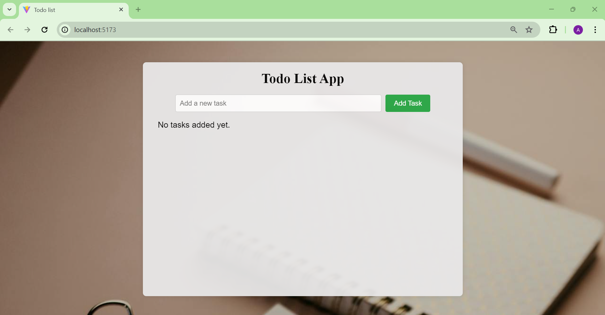
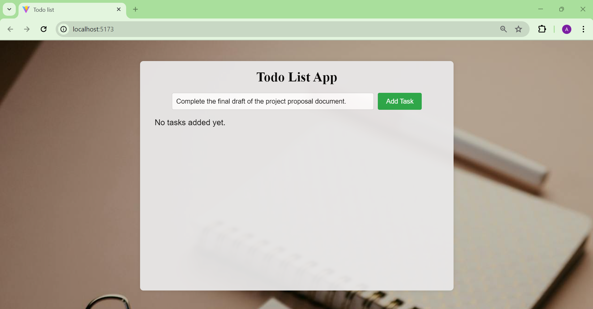
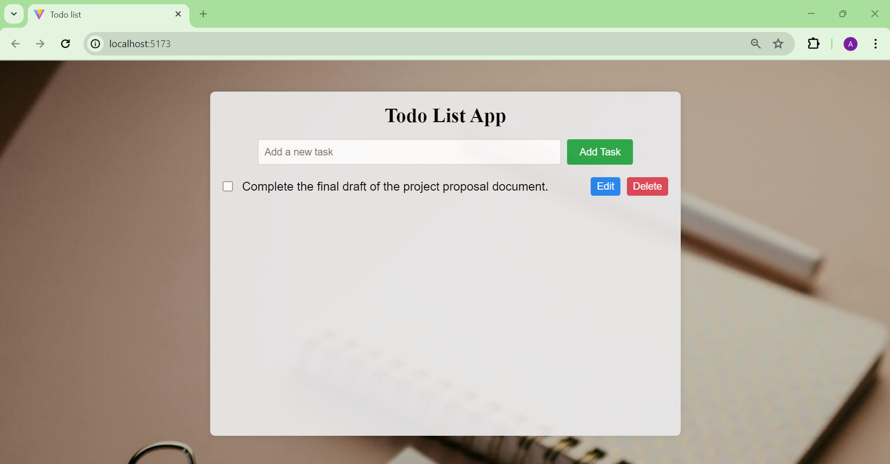
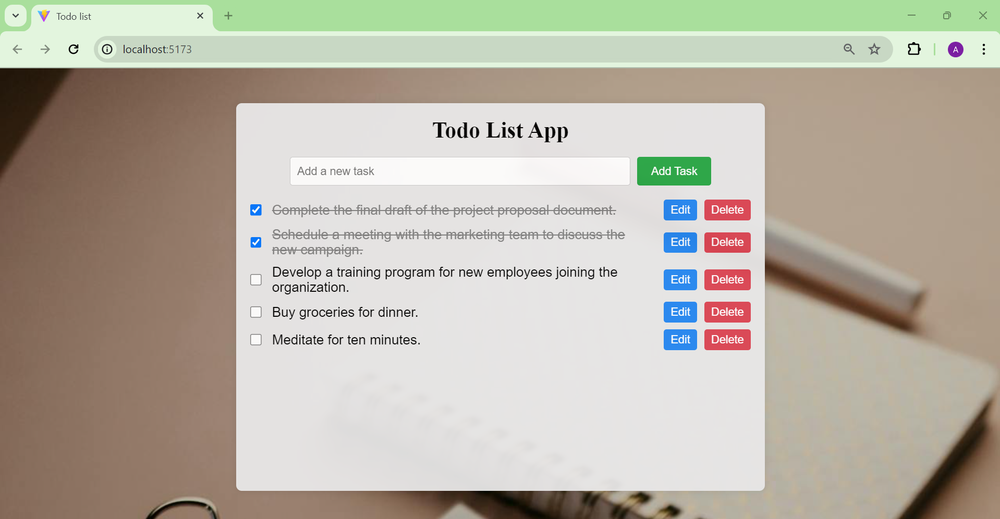
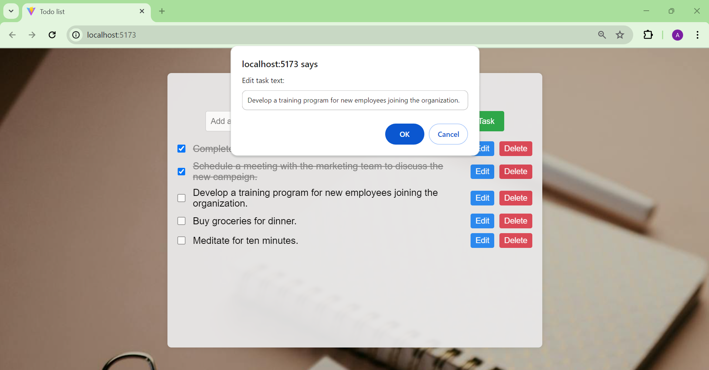
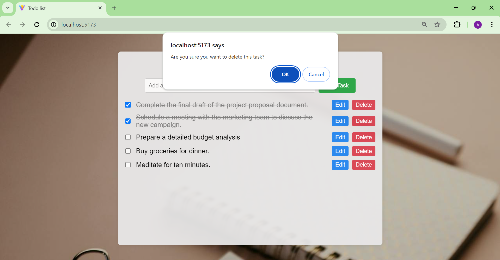
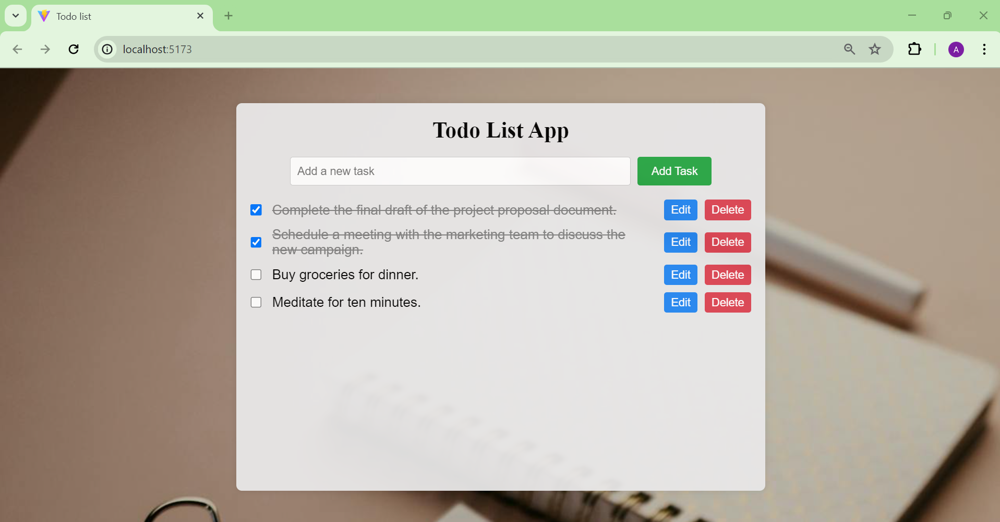

# Todo-list_React
A simple to-do list with react and typescript

## Features
- Add tasks
- Edit tasks
- Delete tasks
- Mark task as completed

When the page loads initially you should see the following page.


## Adding a task
To add a task just click on the input field and type in the task.


After that just click on 'add task' button. The task should be added and you should see the following page.


## Marking a task as done
To mark and unmark a task as done just click on the checkbox on the right.


## Editing a task
To edit a task click on the 'edit' button.
Then you will be prompted to add the new edited text.


After that click on the 'ok' button. The task should be edited with the new text and you should see the following page.


## Deleting a task
To delete a task click on the 'delete' button. You will be prompted to confirm whether to delete the task 

.If you choose ok, the task should be deleted and you should see the following page.


## To run the app
You should have node installed.
Clone the repository and install dependencies by running the following commands:
```bash
git clone https://github.com/AregawiF/Todo-list_React.git
cd Todo-list_React
npm install
npm run dev
''' then follow the link to launch the website.
